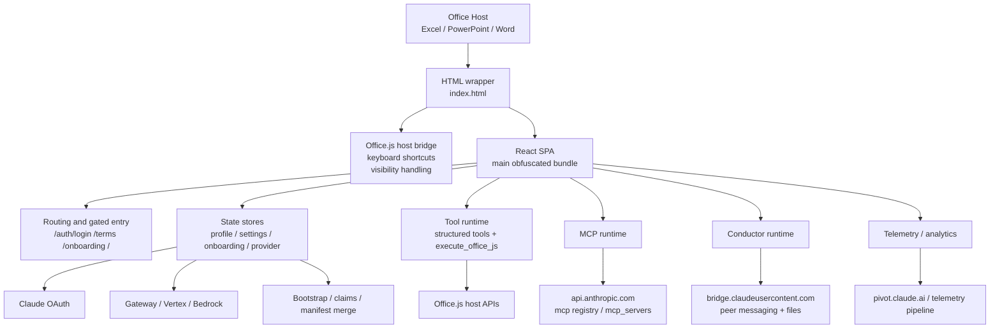

# 01. System Architecture

## Executive summary

The sample is not an Excel-only plugin. It is a unified Office add-in runtime that exposes Excel, PowerPoint, and Word through a shared React SPA, a shared state layer, and a shared agent execution surface named `office-agent`.

The client is responsible for significantly more than rendering UI:

- host integration
- routing and gating
- auth/session persistence
- bootstrap resolution
- provider switching
- MCP initialization
- conductor session management
- tool execution policy
- telemetry and analytics

## Layered architecture

## Entry responsibilities

`index.html` is intentionally thin, but not trivial. It performs the following roles:

- loads Office.js from Microsoft CDN
- hosts the React mount node
- handles taskpane keyboard shortcut toggling at the HTML layer
- posts `KEYBOARD_SHORTCUT_TRIGGERED` messages back into the SPA
- deletes `history.pushState` and `history.replaceState` in the original sample to avoid host/router conflicts

This is strong evidence that the product treats the HTML wrapper as a host-compatibility shim, not a static launcher page.

## Runtime composition

The observable runtime composition is:

- `React`
- `React Router`
- state stores
- Office host adapters
- Anthropic-facing auth/provider code
- MCP client and server registration logic
- conductor peer bus and virtual file-sharing layer
- telemetry + analytics emitters
- a privileged Office.js execution surface with sandboxing

## Supported surfaces

The same client runtime contains logic and embedded instructions for:

- Excel (`sheet`)
- PowerPoint (`slide`)
- Word (`doc`)

This is visible in:

- route gating logic
- telemetry naming
- system prompt fragments
- tool descriptions
- host capability snapshots

## Service identity

Observed constants in the bundle identify the runtime as:

- service name: `office-agent`
- git SHA: `8a3d43cefdceab518a6d097570376a752fe96819`

That naming strongly suggests the product is organized as an Office agent platform, not a collection of isolated per-app extensions.

## Why this matters for reconstruction

A credible reconstruction should not start from “make a spreadsheet chatbot”. It should start from the actual architecture:

1. taskpane shell
2. gated routed UI
3. stateful provider layer
4. workbook tool abstraction
5. privileged host execution path
6. optional external integration layers

This is why the prototype in `rebuild/` recreates the routed shell and tool-calling flow first, rather than trying to clone every Office feature immediately.

