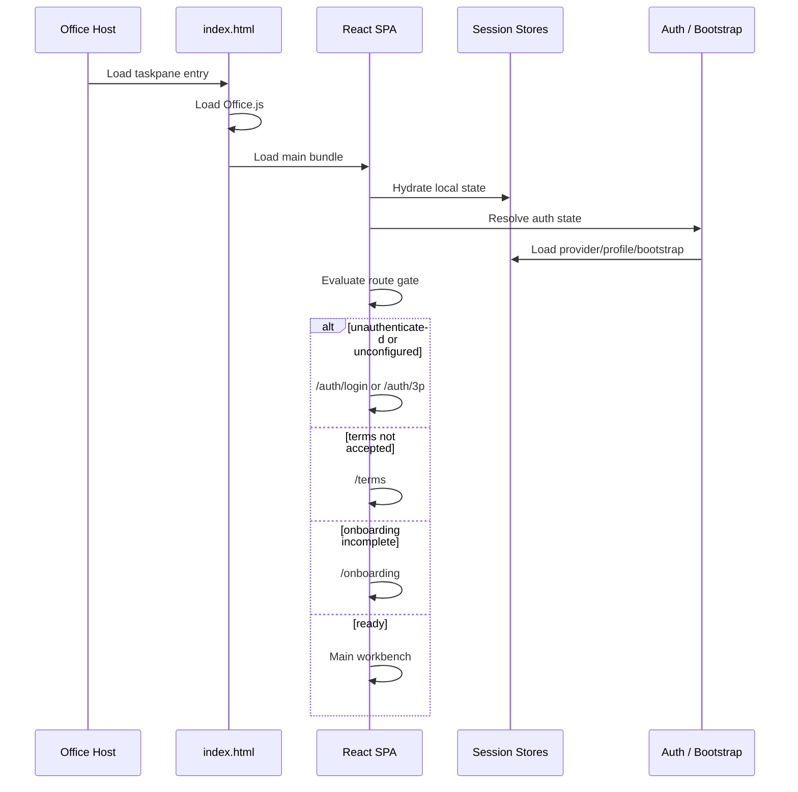

# 02. Boot, Auth, and Provider Flow

## High-level boot sequence

## First-party OAuth flow

The local sample contains a first-party OAuth configuration targeting `claude.ai`.

Observed client data:

- client ID: `966eba67-8b8c-4eae-bbb3-08361d1b9292`
- redirect target: `${window.location.origin}/auth/callback`
- requested scopes:
  - `user:profile`
  - `user:inference`
  - `user:file_upload`
  - `org:profile`
  - `user:mcp_servers`
  - `user:voice`

This is not a low-privilege sign-in flow. The add-in requests a product-wide token capable of inference, uploads, org metadata, and MCP access.

## Callback behavior

The callback page exists because the browser window and the Office taskpane are separate contexts. The observed flow is:

1. browser window completes OAuth
2. callback route receives code/state
3. callback page copies or relays the result
4. taskpane can recover the auth result manually or through host-specific behavior

This explains why the sample also contains a manual paste fallback for login completion.

## Third-party provider model

The sample exposes dedicated routes for three enterprise inference modes:

- `/auth/3p/gateway`
- `/auth/3p/vertex`
- `/auth/3p/bedrock`

This means the client is explicitly designed to run against multiple backend provider classes, not just Anthropic-hosted inference.

## Configuration injection sources

The bundle resolves runtime configuration from three sources:

1. manifest query parameters
2. Entra / NAA claim resolution
3. bootstrap payloads fetched remotely

Observed manifest parameters include:

- `bootstrap_url`
- `entra_sso`
- `auto_connect`
- `allow_1p`
- `gateway_url`
- `gateway_token`
- `gateway_auth_header`
- `gcp_project_id`
- `gcp_region`
- `google_client_id`
- `google_client_secret`
- `aws_role_arn`
- `aws_region`
- `mcp_servers`
- `otlp_endpoint`
- `otlp_headers`

## Provider abstraction

Observed provider kinds in client state:

- `oauth`
- `apiKey`
- `gateway`
- `vertex`
- `bedrock`

This is important for cloning: the provider layer should be abstract and stateful. It should not be hard-coded to a single API contract.

## What the reconstruction keeps

The `rebuild/` prototype preserves the same product shape but collapses auth complexity:

- keeps gated routes: login → terms → onboarding → app
- keeps provider configuration as a persisted client state
- replaces Anthropic OAuth/bootstrap with a direct LiteLLM provider form
- leaves the provider abstraction in place so more backends can be added later

That is the right engineering compromise for a first reconstruction pass.

