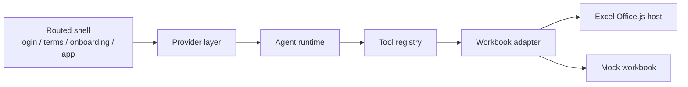

# 05. Reimplementation Strategy

## Target outcome

Build a reconstruction that is structurally faithful enough that new missing subsystems can be added incrementally without rewriting the shell.

## Recommended reconstruction layers

## What the current prototype implements

The `rebuild/` project preserves the following architectural choices from the sample:

- React taskpane UI
- Vite-based client application
- route-gated entry flow
- persisted provider configuration
- tool-calling agent loop
- workbook adapter boundary
- Office.js host integration path
- a separate mock runtime for development outside Office

## What was deliberately simplified

For the first implementation pass, the following subsystems are replaced or deferred:

- Anthropic OAuth → replaced with direct LiteLLM config
- bootstrap / claims merging → replaced with local provider state
- MCP → deferred
- conductor → deferred
- telemetry / analytics → deferred
- Word / PowerPoint feature surfaces → deferred

## Why LiteLLM is the right interim provider

The reverse-engineered client clearly has a provider abstraction already. Replacing the backend with LiteLLM is therefore an architecture-preserving decision rather than a shortcut.

In the reconstruction, LiteLLM serves as:

- a local OpenAI-compatible inference endpoint
- a practical stand-in for the production provider layer
- a way to validate tool-calling behavior without recreating the original SaaS stack

## Development principles

When expanding this reconstruction, prefer this order:

1. stabilize tool contracts
2. harden adapter behavior
3. preserve route and state boundaries
4. add missing enterprise features behind interfaces

Avoid this order:

1. polishing visual parity
2. adding backend complexity first
3. mixing Excel host calls directly into React components

## Concrete next steps after the current prototype

1. Add a sideloadable Office add-in manifest and icon set.
2. Expand Excel tool coverage:
   - `modify_sheet_structure`
   - `copy_to`
   - `resize_range`
   - `get_all_objects`
3. Add basic prompt/tool execution logging.
4. Add conductor-compatible local interfaces even before transport exists.
5. Add a protocol adapter for MCP-compatible local connectors.

